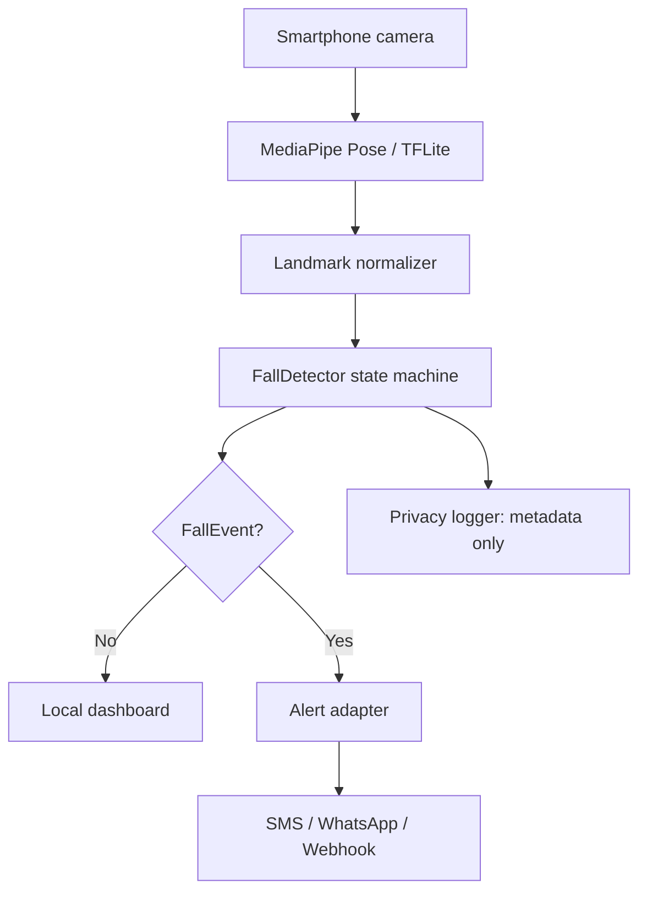

# 🛡️ AICamera · SmartGuard

**Camera thông minh cảnh báo té ngã/đột quỵ · Privacy-first passive fall detection**  
Mã nguồn mở theo giấy phép MIT · 100% nội dung tiếng Việt + English

> **Không thiết bị đeo · No wearables.** Một điện thoại thông minh, một camera và xử lý tại thiết bị có thể tạo ra lớp an toàn thụ động cho người cao tuổi.

[](LICENSE)
[](core/python)
[](https://developers.google.com/mediapipe)
[](#-quyền-riêng-tư--privacy)

## 🌏 Tóm tắt · Overview

**VI —** AICamera là hệ thống phát hiện té ngã thụ động dùng camera điện thoại và ước tính tư thế AI (MediaPipe Pose). Hệ thống theo dõi các điểm khớp 2D trong thời gian thực, đo độ cao tương đối, tốc độ hạ thấp và tư thế nằm thấp; khi các tín hiệu đồng thời vượt ngưỡng và người đó không đứng dậy, nó tạo sự kiện cảnh báo cho người chăm sóc. Không cần vòng tay, không truyền video, có thể chạy ngoại tuyến.

**EN —** AICamera is a passive fall-detection system built around a smartphone camera and AI pose estimation (MediaPipe Pose). It tracks 2D body landmarks in real time, measures relative body height, descent speed and low-ground posture; when the signals agree and the person remains down, it emits an alert event for a caregiver. No wearable is required, no video is streamed, and the detector can run offline.

## 🚩 Bài toán · Problem

| Tiếng Việt | English |
|---|---|
| Người cao tuổi có nguy cơ té ngã nhưng thường không đeo thiết bị vì khó chịu, kỳ thị hoặc quên sạc. | Older adults may not wear a device because it is uncomfortable, stigmatizing or easy to forget. |
| Camera có giá trị an toàn nhưng gia đình lo video bị lưu trữ/đưa lên mạng. | Cameras help with safety, but families worry about stored or uploaded video. |
| Một cú hạ thấp nhanh chưa đủ để kết luận: cần xác nhận theo thời gian để giảm báo giả. | A fast height drop is not enough: temporal confirmation is needed to reduce false alarms. |

## 💡 Giải pháp · Solution

1. **Quan sát không xâm lấn · Unobtrusive observation** — MediaPipe trả về 33 landmark; lõi chỉ nhận tọa độ và độ tin cậy, không cần ảnh sau bước ước tính.
2. **Phát hiện theo chuỗi thời gian · Temporal logic** — hiệu chuẩn tư thế đứng → tính vận tốc → nhận biết hạ thấp nhanh → xác nhận ở tư thế thấp trong một khoảng thời gian.
3. **An toàn riêng tư · Privacy by design** — mặc định không ghi/không gửi video; chỉ phát ra sự kiện nhỏ (thời điểm, confidence, loại sự kiện).
4. **Cảnh báo có kiểm soát · Actionable alert** — ứng dụng có thể gọi SMS/WhatsApp/Webhook; luôn có nút “Tôi ổn / I’m OK” để huỷ báo giả.

> ⚠️ **An toàn y tế · Medical safety:** đây là công cụ hỗ trợ phát hiện té ngã, **không chẩn đoán đột quỵ**. Dấu hiệu đột quỵ (méo miệng, yếu tay, nói khó) cần gọi dịch vụ cấp cứu địa phương ngay; không chờ camera kết luận.

## 🧠 Bản chất nguyên lý · Detection principle

```text
Camera frame → MediaPipe Pose → landmarks (x, y, visibility)
      ↓                    (chỉ dữ liệu khớp, không lưu video)
Temporal features: body_height, hip_height, descent_velocity,
                   torso_angle, low_posture_duration
      ↓
State machine: CALIBRATING → STANDING → DESCENDING → ON_GROUND
      ↓
FallEvent {confidence, timestamp, evidence} → caregiver adapter
```

`body_height` là khoảng cách dọc tương đối từ mũi đến trung bình hai mắt cá. Tỷ lệ này bền hơn pixel tuyệt đối khi điện thoại đổi vị trí. `descent_velocity` được làm mượt bằng median/EMA để chống nhiễu. Một cảnh báo chỉ được phát khi có **hạ thấp nhanh + tư thế nằm thấp + giữ trạng thái thấp đủ lâu**; nếu người dùng đứng dậy trong cửa sổ huỷ, sự kiện bị loại.

## 🏗️ Kiến trúc · Architecture



**VI —** `core/python/smartguard_core.py` là nguồn sự thật cho thuật toán; `prototype/app` là UI MediaPipe; `demo/index.html` là mô phỏng tĩnh chạy không cần camera; `core/go` là gateway nhận sự kiện để tích hợp hệ thống; `core/cpp` dành cho camera edge/nhúng.  
**EN —** `core/python/smartguard_core.py` is the algorithmic source of truth; `prototype/app` is the MediaPipe UI; `demo/index.html` is a camera-free static simulation; `core/go` is an event gateway; `core/cpp` targets embedded/edge cameras.

## 🚀 Chạy nhanh · Quick start

### 1) Demo mô phỏng offline · Offline simulation

```bash
python3 core/python/demo_simulation.py --scenario fall --json
python3 core/python/demo_simulation.py --scenario recovery
```

Mô phỏng tạo landmark nhân tạo cho ba pha **đứng → hạ thấp → nằm**, không dùng camera và không tải mô hình.  
The simulator creates synthetic landmarks for **standing → descent → on-ground**, with no camera and no model download.

### 2) Core Python + MediaPipe/OpenCV

```bash
python3 -m venv .venv && . .venv/bin/activate
pip install -r core/python/requirements.txt
python3 core/python/webcam_demo.py --camera 0
```

`webcam_demo.py` chỉ hiển thị skeleton và trạng thái; để gửi cảnh báo, nối callback vào `EventSink` của ứng dụng. Có thể thay MediaPipe bằng YOLO pose mà không đổi state machine.

### 3) Demo trình duyệt · Browser demo

Mở [demo/index.html](demo/index.html) trực tiếp hoặc chạy `python3 -m http.server 8000`, rồi vào `http://localhost:8000/demo/`. Demo có nút phát từng kịch bản, thanh thời gian, điểm confidence và nhật ký sự kiện — hoàn toàn offline.

## 🧪 So sánh OpenCV + MediaPipe và YOLOv11 Pose · Comparison

| Tiêu chí · Criterion | OpenCV + MediaPipe Pose | YOLOv11-Pose |
|---|---|---|
| Bản chất · Nature | Pipeline landmark chuyên tư thế; 33 điểm khớp. | Detector + keypoint model; phát hiện nhiều người/đối tượng trong một lượt. |
| Tài nguyên · Edge cost | Nhẹ, phù hợp điện thoại, WASM/TFLite, chạy real-time CPU. | Nặng hơn; GPU/NPU giúp FPS và nhiều người tốt hơn. |
| Theo dõi khung xương · Skeleton | Sẵn smoothing/tracking, API đơn giản; tốt cho một người trong phòng. | Linh hoạt nhiều người, confidence và bounding box rõ; cần tracker/smoothing bổ sung. |
| Té gục đột ngột · Sudden fall | Đủ tốt khi camera cố định, góc nhìn rõ; dễ giải thích bằng hình học. | Mạnh hơn ở cảnh đông, che khuất và xa; cần huấn luyện/đánh giá miền dữ liệu. |
| Riêng tư/ngoại tuyến · Privacy/offline | Có thể chạy toàn bộ trên thiết bị; không cần gửi ảnh. | Cũng có thể edge, nhưng model lớn hơn và license/model card phải kiểm tra. |
| Khuyến nghị · Recommendation | **MVP smartphone, một người, chi phí thấp.** | **Camera cố định nhiều người, cần scale/robustness.** |

Không có mô hình nào “tốt hơn” tuyệt đối: hãy đo precision/recall, false alarms mỗi giờ, latency, nhiệt và pin trên chính bối cảnh lắp đặt.  
No model is universally “better”: benchmark precision/recall, false alarms per hour, latency, thermals and battery on the actual deployment scene.

## 🌲 Mở rộng cùng một lõi · Reusable vision core

| Bài toán · Use case | Thay đổi chính · Main change | Cảnh báo triển khai · Deployment note |
|---|---|---|
| Cháy rừng · Wildfire | YOLO/segmentation cho lửa, khói, hotspot; thêm geofence. | Không dùng fall threshold; cần chống sương/mây và xác minh đa camera. |
| Phân loại thực vật · Plants | Classifier/segmenter theo loài, dữ liệu địa phương. | Kiểm tra mùa vụ, ánh sáng và quyền dữ liệu. |
| Cỏ dại + laser · Weeds + laser | Segment cỏ dại → lập bản đồ điểm → bộ điều khiển laser. | **Bắt buộc fail-safe**, vùng cấm người/vật nuôi, interlock và kiểm định an toàn laser. |
| Đếm vật nuôi · Livestock | Detector + tracker (ByteTrack/OC-SORT), vùng đếm và chống đếm lặp. | Cần camera cao, ánh sáng ổn định và kiểm thử giống/chuồng. |
| Biển số · ANPR | Detector biển số + OCR (PaddleOCR/Tesseract). | Mã hoá, giới hạn lưu giữ, tuân thủ pháp luật dữ liệu cá nhân. |

## 🔐 Quyền riêng tư · Privacy

- **Mặc định · Default:** không ghi video, không lưu ảnh; chỉ giữ landmark trong RAM theo cửa sổ ngắn.
- **Tối thiểu hoá · Minimization:** nhật ký chỉ gồm timestamp, confidence, trạng thái và mã camera băm.
- **Ngoại tuyến · Offline:** MediaPipe/TFLite chạy tại thiết bị; mạng chỉ bật khi người dùng chọn kênh cảnh báo.
- **Minh bạch · Transparency:** hiển thị camera đang hoạt động, nút dừng, thời gian lưu và danh sách người nhận.

## 📁 Cấu trúc · Repository layout

```text
core/python/       thuật toán, adapter MediaPipe/OpenCV, mô phỏng, test
core/go/           gateway webhook tối giản (Go stdlib)
core/cpp/          header C++17 cho edge runtime
core/haskell/      state machine thuần hàm để kiểm chứng quy tắc
demo/              mô phỏng trình duyệt không camera
prototype/app/     giao diện React/Vite hiện có
docs/              pitch deck và tài liệu dự án
```

## 🤝 Đóng góp · Contributing

Vui lòng mở issue mô tả camera, FPS, góc nhìn, ánh sáng và tiêu chí đánh giá. Không đưa video nhạy cảm vào issue; dùng landmark đã ẩn danh. Pull request nên kèm test mô phỏng và báo cáo false-positive.  
Please include camera, FPS, viewpoint, lighting and evaluation criteria. Do not upload sensitive video; use anonymized landmarks. Pull requests should include a simulation test and false-positive report.

## 📜 Giấy phép · License

MIT — xem [LICENSE](LICENSE). MediaPipe, OpenCV, YOLO và các model bên thứ ba vẫn tuân theo giấy phép/model card riêng của chúng.

## 🆘 Tuyên bố an toàn · Safety statement

Đây là phần mềm nghiên cứu/prototype, không phải thiết bị y tế được chứng nhận. Luôn có quy trình gọi người thật/cấp cứu, kiểm tra camera và kiểm thử với người giám sát trước khi dùng thực tế.  
This is research/prototype software, not a certified medical device. Maintain a human/emergency escalation path and validate with a supervisor before real-world use.
